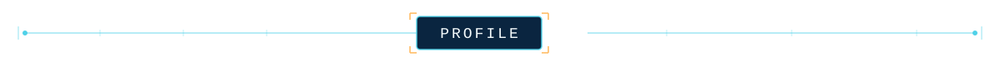
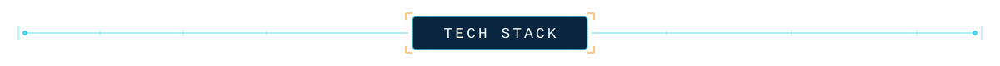
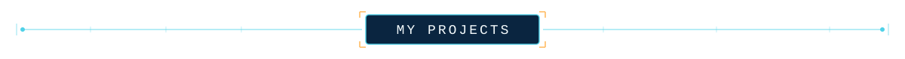
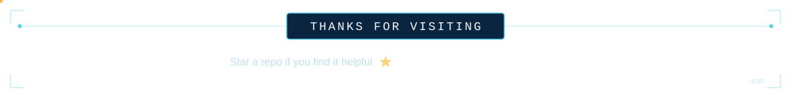

<picture>
  <source media="(prefers-color-scheme: dark)" srcset="./newassets/Header-name2.svg">
  <source media="(prefers-color-scheme: light)" srcset="./header.svg">
  
</picture>

 

 

  

 

I'm a Computer Science student passionate about **Artificial Intelligence and Machine Learning**.

Currently exploring **Deep Learning, Generative AI, LLMs, and Agentic AI** while building practical projects with Python.

I enjoy turning ideas into real-world applications and learning through hands-on development.

 

## Connect With Me

&nbsp;

&nbsp;

&nbsp;

 

---

  

 

###  AI & Machine Learning

  

 

###  Web Development

  

 

###  Backend & APIs

  

 

###  DevOps & Tools

  

 

---

  

 

##  CrashRadar

**AI-powered Road Accident Detection & Analytics**

A full-stack accident detection system using **YOLOv8, custom object tracking, and trajectory-based analysis** to identify potential road accidents from live and uploaded footage.

The system combines weighted **trajectory, deceleration, and collision-overlap analysis** with a React + Flask dashboard backed by SQLite.

**Tech:** `Python` `YOLOv8` `OpenCV` `Flask` `React` `SQLite`

 

---

##  Ariadne

**LLM Agent Benchmark for Active Directory Attack Paths**

A reproducible benchmark that evaluates whether an **LLM agent can discover privilege-escalation paths** through an Active Directory graph.

It compares agent-based reasoning against **BloodHound's rule-based approach**, including attack paths that traditional queries may not identify.

**Tech:** `Python` `LLMs` `Neo4j` `Graph Analysis`

 

---

  

  

 

