<picture>
  <source media="(prefers-color-scheme: dark)" srcset="./header-dark.svg">
  <source media="(prefers-color-scheme: light)" srcset="./header.svg">

  
</picture>

<br/>

<div align="center">


</div>

---

<div align="center">
  
</div>

```python
humera = {
    "role": "Applied AI & ML Explorer",
    "focus": "Learning GenAI systems and building AI/ML projects",
    "learning": ["Machine Learning", "Deep Learning", "LLMs basics"],
    "interests": ["Applied AI", "GenAI", "Agentic AI (exploring)"],
    "currently_building": "small AI/ML projects using Python and LLM APIs",
    "stack": ["Python", "basic ML libraries", "LLM APIs"],
    "mindset": "Learn deeply • Build consistently • Improve step by step"
}
```


-  Passionate about building intelligent systems using AI & Machine Learning.
- Currently building ML + GenAI projects while improving deployment and system design skills.
- Focused on creating projects that combine technology, usability, and impact.
- Continuously learning through hands-on projects and experimentation.

---

## ✦ Connect With Me

<div align="center">

[](https://www.linkedin.com/in/humera-mahreen-958765329)
[](mailto:hmahreen3105@gmail.com)
[](https://github.com/Humera-tech)

</div>

---


<div align="center">
  
</div>

<div align="center">
<div align="center">
  
</div>

###  AI & Machine Learning


<br><br>


</div>

<br>

<div align="center">

###  Frontend Development


</div>

<br>
<div align="center">

<div align="center">

### ⚙️ Backend Development & Databases


</div>

<div align="center">

###  Tools & Deployment


<br><br>


</div>

---


<div align="center">
  
</div>

<div align="center">
  
</div>

<br>

<div align="center">


</div>

<br>

<div align="center">


</div>
---


<div align="center">


</div>

---

## ✦ LeetCode

<div align="center">


<br><br>

[](https://leetcode.com/HumeraMahreen)

</div>

---

<div align="center">


&nbsp;
[](https://github.com/Humera-tech?tab=repositories&sort=stargazers)

<br/>


</div>
